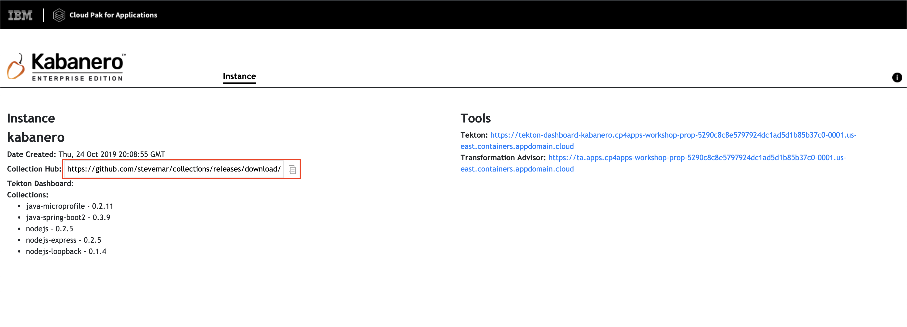

# Exercise 7: Configuring Kabanero to use an Alternate Collection Repository

In this exercise, we will show how to update your Kabanero instance to use a custom Kabanero Collection Hub.

When you have completed this exercise, you will understand how to

* update some YAML

## Prerequisites

You should have already carried out the prerequisites defined in [Exercise 6](workshop/exercise-6/README.md).

## Steps

1. Get release URL
2. Edit Kabanero Custom Resource
3. Test it out

## 1. Get release URL

Obtain the URL to the collection repository. If a Git release was created for the collections, the URL format will be: `https://<github.com>/<organization>/collections/releases/download/<release>/kabanero-index.yaml`

In our workshop, it'll likely be:

`https://github.com/<username>/collections/releases/download/0.1.0/kabanero-index.yaml`

* Replace `<username>` with your Github username

## 2. Edit Kabanero Custom Resource

Use `oc get kabaneros -n kabanero` to obtain a list of all Kabanero CR instances in namespace `kabanero`. The default name for the CR instance is `kabanero`.

```bash
oc get kabaneros -n kabanero
```

You should see output similar to the following:

```bash
$ oc get kabaneros -n kabanero
NAME       AGE       VERSION   READY
kabanero   17d       0.1.0     True
```

Edit the speific CR instance using `oc edit kabaneros <name> -n kabanero`, replacing `<name>` with the instance name.

```bash
oc edit kabaneros kabanero -n kabanero
```

Modify your Kabanero custom resource (CR) instance to target the new collections that were pushed to the remote Github repository. The `Spec.Collections.Repositories.url` attribute should be set to the URL of the collection repository.

```yaml
apiVersion: kabanero.io/v1alpha1
kind: Kabanero
metadata:
  name: kabanero
  namespace: kabanero
spec:
  collections:
    repositories:
    - name: custom
      url: https://github.com/<username>/collections/releases/download/0.1.0/kabanero-index.yaml
      activateDefaultCollections: true
```

When you are done editing, save your changes and exit the editor. The updated Kabanero CR instance will be applied to your cluster.

## 3. Test it out

To see a list of all collections in the `kabanero` namespace, use `oc get collections -n kabanero`.

```bash
oc get collections -n kabanero
```

You should see output similar to the following:

> TODO(stevemar): My new stack isn't appearing :(

```bash
$ oc get collections -n kabanero
NAME                AGE
java-microprofile   17d
java-spring-boot2   17d
nodejs              17d
nodejs-express      17d
nodejs-loopback     17d
```

And your collection should appear in the Cloud Pak for Applications dashboard, too.



**Congratulations!!** We've got our Kabanero instance updated to use our custom collection.
