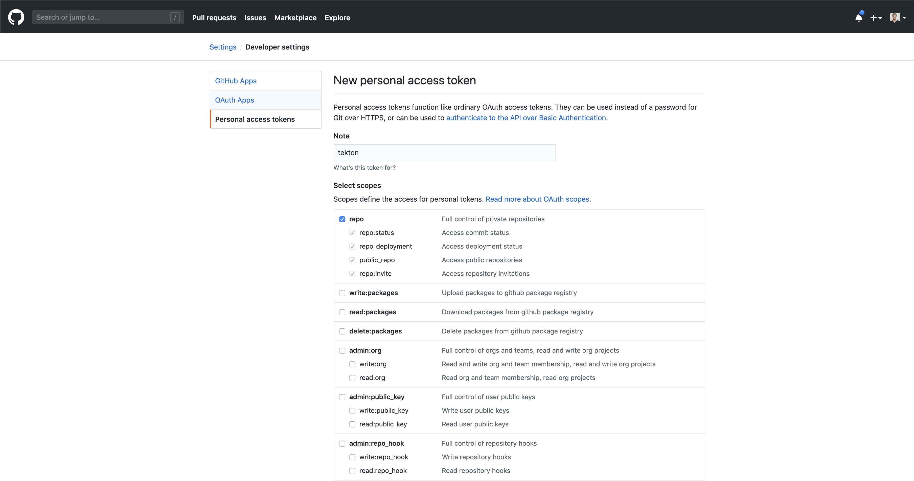
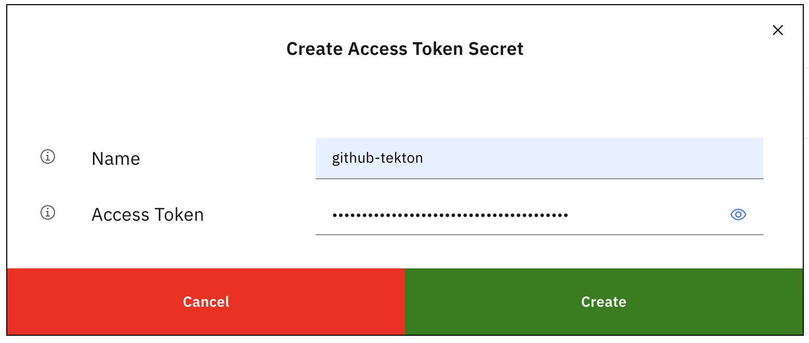
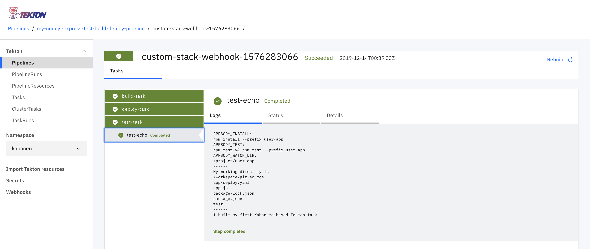

# Exercise 9: Deploy an application with a custom Stack, custom Collection, and custom Pipeline

In this exercise, we will show how to bring all the custom components (Stacks, Collections, Pipelines) together.

When you have completed this exercise, you will understand how to

* Create a custom pipeline and add it to a collection
* Update the Kabanero Custom Resource to point to a new collection
* Deploy an application based on a custom stack using a custom Tekton pipeline


## Prerequisites

You should have already carried out the prerequisites defined in [Exercise 6](../exercise-6/README.md).

### Get a GitHub Access Token

When using Tekton, building a pipeline will require code to be pulled from either a public or private repository. When configuring Tekton, for security reasons, we will create an *Access Token* instead of using a password.

To create an *Access Token*, from [Github.com](Github.com) click on your profile icon in the top left. Then go to `Settings` -> `Developer Settings` -> `Personal Access Tokens`. Or go directly to <https://github.com/settings/tokens>


Here we want to generate a token, so `Click` on the `Generate a Token`. The token permissions need to be the `repo` which gives read and write access to the repository.



Once the token is created, make sure to copy it down. We will need it later.

## Steps

### 1. Prepare the new application for deployment

Before you can deploy this application using the pipeline you will be building in the upcoming exercises, there needs to be a deployment file added to the application. The deployment file is called `app-deploy.yaml`. This file was created automatically for you in day 1 exercise 3 with the `appsody deploy` command.

It can also be created without deploying an application using the `--generate-only` flag. Run these commands:

```bash
cd ~/appsody-apps/test-custom-stack

appsody deploy --generate-only
```

```bash
$ appsody deploy --generate-only
Extracting project from development environment
Pulling docker image docker-registry-default.timro-roks1-5290c8c8e5797924dc1ad5d1b85b37c0-0001.us-east.containers.appdomain.cloud/kabanero-noauth/my-nodejs-express:0.3
Running command: docker pull docker-registry-default.timro-roks1-5290c8c8e5797924dc1ad5d1b85b37c0-0001.us-east.containers.appdomain.cloud/kabanero-noauth/my-nodejs-express:0.3
0.3: Pulling from kabanero-noauth/my-nodejs-express
Digest: sha256:9145b3477ca00e2401d100380460a5d813a6f291ee149d10ac7d989f1923f1e3
Status: Image is up to date for docker-registry-default.timro-roks1-5290c8c8e5797924dc1ad5d1b85b37c0-0001.us-east.containers.appdomain.cloud/kabanero-noauth/my-nodejs-express:0.3
Running command: docker run --name test-custom-stack-extract -v C:/Users/TimRobinson/appsody-apps/test-custom-stack/:/project/user-app --entrypoint /bin/bash docker-registry-default.timro-roks1-5290c8c8e5797924dc1ad5d1b85b37c0-0001.us-east.containers.appdomain.cloud/kabanero-noauth/my-nodejs-express:0.3 -c cp -rfL /project /tmp/project
...
```

After the command completes, check the contents of the application directory with `ls`

```bash
app.js  app-deploy.yaml  node_modules/  package.json  package-lock.json  test/
```

### 2. Upload custom stack test to GitHub

From completing the previous exercise you should now have a code base in the following folder

```bash
cd ~/appsody-apps/test-custom-stack
ls -la
```

Should result in output that looks like the following:

```bash
$ ls -la
total 144
drwxr-xr-x  14 stevemar  staff    448 19 Nov 14:20 .
drwxr-xr-x   9 stevemar  staff    288 19 Nov 16:26 ..
-rw-r--r--   1 stevemar  staff     70 15 Nov 10:02 .appsody-config.yaml
-rw-r--r--   1 stevemar  staff   1316 15 Nov 10:02 .gitignore
-rw-r--r--   1 stevemar  staff    130 15 Nov 10:12 app.js
drwxr-xr-x   2 stevemar  staff     64 15 Nov 10:03 node_modules
-rw-r--r--   1 stevemar  staff  51421 15 Nov 10:02 package-lock.json
-rw-r--r--   1 stevemar  staff    455 19 Nov 12:52 package.json
drwxr-xr-x   3 stevemar  staff     96 15 Nov 10:02 test
```

We will now upload that code to Github.

Go to <https://github.com/new> and create a new repository, `test-custom-stack`. Do not initiatize the repos with a license file or README.

From your `test-custom-stack` directory, run the commands below.

```bash
git init
git add -A
git commit -m "first commit"
git remote add my-org https://github.com/$GITHUB_USER/test-custom-stack.git
git push -u my-org master
```

>If your GITHUB_USER variable is not set, run `export GITHUB_USER=<username>` while replacing `<username> with your github username.

The repo should look like this:


### 3. Add the tasks to the collection

In the next steps we are going to add a custom pipeline that contains a `task` and a `pipeline` within your local `collections/incubator/my-nodejs-express/pipelines` folder.

First, change directory into your `collections/incubator/my-nodejs-express/pipelines` folder:

```bash
cd ~/appsody-apps/collections/incubator/my-nodejs-express/pipelines
```

Then use the following commands to create the `custom-pipeline` directory and the `test-task.yaml` and `test-build-deploy-pipeline.yaml` files:

```bash
mkdir custom-pipeline

cd custom-pipeline

touch test-task.yaml

touch test-build-deploy-pipeline.yaml
```

The file structure should look like the example below

```ini
incubator
└── my-nodejs-express/
    └── pipelines/
        └── custom-pipeline/
              └── test-task.yaml
              └── test-build-deploy-pipeline.yaml
```

In `test-task.yaml` enter the following:

```yaml
#Kabanero! on activate substitute CollectionId for text 'CollectionId'
apiVersion: tekton.dev/v1alpha1
kind: Task
metadata:
  name: CollectionId-test-task
spec:
  inputs:
    resources:
      - name: git-source
        type: git
  outputs:
    resources:
      - name: docker-image
        type: image
  steps:
    - name: test-echo
      image: kabanero/nodejs-express:0.2
      workingDir: ${inputs.resources.git-source.path}
      command:
        - /bin/bash
      args:
        - -c
        - |
          set -e
          echo "APPSODY_INSTALL:"
          echo $APPSODY_INSTALL
          echo "APPSODY_TEST:"
          echo $APPSODY_TEST
          echo "APPSODY_WATCH_DIR:"
          echo $APPSODY_WATCH_DIR
          echo "------"
          echo "My working directory is:"
          pwd
          ls
          echo "------"
          echo "I built my first Kabanero based Tekton task"
```

And the `test-build-deploy-pipeline.yaml` is a modification of the default pipeline:

```yaml
#Kabanero! on activate substitute CollectionId for text 'CollectionId'
apiVersion: tekton.dev/v1alpha1
kind: Pipeline
metadata:
  name: CollectionId-test-build-deploy-pipeline
spec:
  resources:
    - name: git-source
      type: git
    - name: docker-image
      type: image
  tasks:
    - name: test-task
      taskRef:
        name: CollectionId-test-task
      resources:
        inputs:
        - name: git-source
          resource: git-source
        outputs:
        - name: docker-image
          resource: docker-image
    - name: build-task
      taskRef:
        name: CollectionId-build-task
      runAfter: [test-task]
      resources:
        inputs:
        - name: git-source
          resource: git-source
        outputs:
        - name: docker-image
          resource: docker-image
    - name: deploy-task
      taskRef:
        name: CollectionId-deploy-task
      runAfter: [build-task]
      resources:
        inputs:
        - name: git-source
          resource: git-source
        - name: docker-image
          resource: docker-image
```

In `incubator/my-nodejs-express` update `collection.yaml` to change the default pipeline

```yaml
default-image: my-nodejs-express
default-pipeline: my-nodejs-express-test-build-deploy-pipeline
images:
- id: my-nodejs-express
  image: $IMAGE_REGISTRY_ORG/my-nodejs-express:0.4
```

Unusually in these exercises, we have been using a version of appsody that is ahead of the current level baked into some the standard kabanero tekton artifacts, so there is one additional change that is needed to get around this. You need to update a tag in the common `build-task.yaml` used for all stacks in the collection. This update will select a builder container that uses appsody 0.5.3 to support the private registry semantics used in these exercises.

Open the `incubator/common/pipelines/default/build-task.yaml` file and add the tag `:0.5.3-buildah1.9.0` to the image spec in the **assemble-extract** step as shown:

```yaml
#Kabanero! on activate substitute CollectionId for text 'CollectionId'
apiVersion: tekton.dev/v1alpha1
kind: Task
metadata:
  name: CollectionId-build-task
spec:
  inputs:
    resources:
      - name: git-source
        type: git
    params:
      - name: pathToDockerFile
        default: /workspace/extracted/Dockerfile
      - name: pathToContext
        default: /workspace/extracted
  outputs:
    resources:
      - name: docker-image
        type: image
  steps:
    - name: assemble-extract
      securityContext:
        privileged: true
      image: appsody/appsody-buildah:0.5.3-buildah1.9.0
      command: ["/bin/bash"]
      args:
        - -c
        - "/extract.sh"
      env:
        - name: gitsource
          value: git-source
      volumeMounts:
        - mountPath: /var/lib/containers
          name: varlibcontainers
...
```

### 4. Re-run the scripts

Run `build.sh` and `release.sh` as before. Run:

```bash
cd ~/appsody-apps/collections
```

```bash
IMAGE_REGISTRY_ORG=$IMAGE_REGISTRY/$IMAGE_REGISTRY_ORG ./ci/build.sh
IMAGE_REGISTRY="" IMAGE_REGISTRY_PASSWORD="" ./ci/release.sh
```

Check the `ci/release/` folder to make sure there is a file called (your version may be different):

```ini
incubator.my-nodejs-express.v0.3.0.pipeline.custom-pipeline.tar.gz
```

And that the generated `ci/release/kabanero-index.yaml` has a section like the following:

```yaml
- default-image: my-nodejs-express
  ...
  pipelines:
  - id: custom-pipeline
    sha256: e3c3050850bf88b97c8fba728592d0cf671bb9d27b582ebaa9f90d939bfa60a5
    url: https://github.com/stevemar/collections/releases/download/0.2.1-custom/incubator.my-nodejs-express.v0.3.0.pipeline.custom-pipeline.tar.gz
```

### 5. Update the current release

Upload the changes

```bash
# Add your custom stack changes
git add -A

# Create a commit message
git commit -m "Add custom task and pipeline"

# Push the changes to your repository.  For example:
git push -u my-org
```

Now we need to use the same script we used in exercise 6 to upload files.

From the collections dir, run the following commands:

```bash
./GithubRelease.sh delete

./GithubRelease.sh upload

```

When that is done you can navigate to your collections repo and view the release in the browser to verify that files have been uploaded.

### 6. Update the Kabanero Custom Resource

Use `oc get kabaneros -n kabanero` to obtain a list of all Kabanero CR instances in namespace `kabanero`. The default name for the CR instance is `kabanero`.

```bash
oc get kabaneros -n kabanero
```

You should see output similar to the following:

```bash
$ oc get kabaneros -n kabanero
NAME       AGE       VERSION   READY
kabanero   17d       0.1.0     True
```

Edit the specific CR instance using `oc edit kabaneros <name> -n kabanero`, replacing `<name>` with the instance name.

```bash
oc edit kabaneros kabanero -n kabanero
```

Modify your Kabanero custom resource (CR) instance to target the new collections that were pushed to the remote Github repository. The `Spec.Collections.Repositories.url` attribute should be set to the URL of the collection repository.

```yaml
apiVersion: kabanero.io/v1alpha1
kind: Kabanero
metadata:
  name: kabanero
  namespace: kabanero
spec:
  collections:
    repositories:
    - name: central
      url: https://github.com/<username>/collections/releases/download/0.2.1-custom/kabanero-index.yaml
      activateDefaultCollections: true
```

When you are done editing, save your changes and exit the editor. The updated Kabanero CR instance will be applied to your cluster.

### 7. Launch the Tekton dashboard

You can launch the tekton dashboard by accessing the *Cloud Pak for Applications* dashboard and selecting the Tekton link. Revisit the [Pre-work](../pre-work/README.md) section if unable to recall how to access the *Cloud Pak for Applications* dashboard.


You can also obtain the URL for the tekton dashboard by using `oc get routes`. We want to use the address that looks like `tekton-dashboard-kabanero.xyz.domain.containers.appdomain.cloud`.

```bash
$ oc get routes --namespace kabanero
NAME               HOST/PORT                                                                                                             PATH      SERVICES           PORT      TERMINATION          WILDCARD
icpa-landing       ibm-cp-applications.cpa-workshop-dev-5290c8c8e5797924dc1ad5d1b85b37c0-0001.us-east.containers.appdomain.cloud                   icpa-landing       <all>     reencrypt/Redirect   None
kabanero-cli       kabanero-cli-kabanero.cpa-workshop-dev-5290c8c8e5797924dc1ad5d1b85b37c0-0001.us-east.containers.appdomain.cloud                 kabanero-cli       <all>     passthrough          None
kabanero-landing   kabanero-landing-kabanero.cpa-workshop-dev-5290c8c8e5797924dc1ad5d1b85b37c0-0001.us-east.containers.appdomain.cloud             kabanero-landing   <all>     passthrough          None
tekton-dashboard   tekton-dashboard-kabanero.cpa-workshop-dev-5290c8c8e5797924dc1ad5d1b85b37c0-0001.us-east.containers.appdomain.cloud             tekton-dashboard   <all>     reencrypt/Redirect   None
```

#### Review pre-installed pipelines and tasks on Cloud Pak for Apps

There are 5 **Pipelines**, one for each collection kabanero comes with (java microprofile, spring, nodejs, express, and loopback). **Pipelines** are a first class structure in Tekton. **Pipelines** are a series of **Tasks**.

These are visible through the UI by clicking on `pipelines` on the left side of the Tekton dashboard:


There are 10 **Tasks**, two for each collection kabanero comes with. Each collection has 2 **Tasks**, a *Build Task* and a *Deploy Task*.

These are visible through the UI by clicking on `tasks` on the left side of the Tekton dashboard:


### 8. Add webhooks to Tekton to watch Github repo changes and testing it all out

Configure the GitHub webhook to your repo. Go to `Webhooks` > `Add Webhook` and then create the webhook.


> Note that the first time creating a webhook a new access token must also be created. To do this, click on the green plus sign to the right of `Access token`, enter a name like `github-tekton', and use the access token from the earlier step:



```ini
Name: custom-stack-webhook
Repository URL: https://github.com/{username}/test-custom-stack
Access Token: github-tekton

Namespace: kabanero
Pipeline: my-nodejs-express-test-build-deploy-pipeline
Service account: kabanero-operator
Docker Registry: docker-registry.default.svc:5000/kabanero
```

When the pipeline runs, it should, in addition to running the new test task, also run the build and deploy task. You can test this by making a minor update to your test-custom-stack repo. Once you have done this then re-commit to trigger the webhook by:

```bash
git add -u
git commit -m "Minor update to test pipeline"
git push -u my-org
```

Return to the Tekton *Pipeline Runs* tab to check on the status of your deployment.


 After a while it should show that the pipeline run is complete.


You can also click on the specific pipeline run link (`custom-stack-1576283066` in the above example), and see the progress of the three tasks which make up the new pipeline. Once they are all complete, it should look similar to the picture below. Notice how you can click on a given task (e.g. the new test-task we created) to see the output.



Although the task we added was a test task, you can imagine how you might add additional tasks that are more relevant to your enterprise environment - for example to check that the application code added by the developer meets your security standards.

Once the pipeline run is complete, you can confirm that our test application, with the upgraded stack, is now running with a curl -v to the route. You should see helmet responses, e.g.:

```bash
$ curl -v http://test-custom-stack-kabanero.timro-roks1-5290c8c8e5797924dc1ad5d1b85b37c0-0001.us-east.containers.appdom
ain.cloud/
*   Trying 169.62.48.20...
* TCP_NODELAY set
* Connected to test-custom-stack-kabanero.timro-roks1-5290c8c8e5797924dc1ad5d1b85b37c0-0001.us-east.containers.appdomain.cloud (169.62.48.20) port 80 (#0)
> GET / HTTP/1.1
> Host: test-custom-stack-kabanero.timro-roks1-5290c8c8e5797924dc1ad5d1b85b37c0-0001.us-east.containers.appdomain.cloud
> User-Agent: curl/7.63.0
> Accept: */*
>
< HTTP/1.1 200 OK
< X-DNS-Prefetch-Control: off
< X-Frame-Options: SAMEORIGIN
< Strict-Transport-Security: max-age=15552000; includeSubDomains
< X-Download-Options: noopen
< X-Content-Type-Options: nosniff
< X-XSS-Protection: 1; mode=block
< X-Powered-By: Express
< Content-Type: text/html; charset=utf-8
< Content-Length: 34
< ETag: W/"22-E8hT/HhjJRx/5AG3TOq9TBd5R7g"
< Date: Sat, 14 Dec 2019 00:40:30 GMT
< Set-Cookie: e23eec15db4cc24793d795555bb55650=b8749458e2714fe3be1767f782a35058; path=/; HttpOnly
< Cache-control: private
<
Hello from a Custom Appsody Stack!* Connection #0 to host test-custom-stack-kabanero.timro-roks1-5290c8c8e5797924dc1ad5d1b85b37c0-0001.us-east.containers.appdomain.cloud left intact
```

**Congratulations!!** You have completed Day 2 of the workshop! You have successfully created a custom appsody stack, included it in a custom Collection that also includes a custom pipeline - showing how you can adapt the standard kabanero infrastructure to suit the needs of your enterprise.
